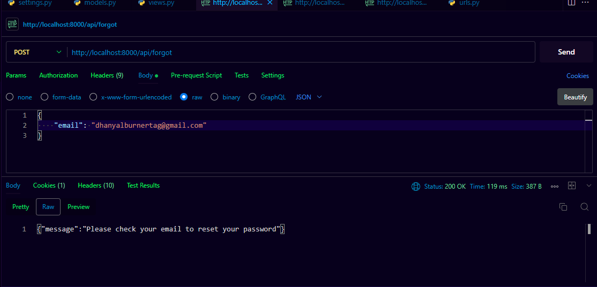

# Django User Authentication and Login/Register/Forgot Password Project

This project implements user authentication and login/register/forgot password functionality using Django and MySQL. It allows users to create an account, log in, reset their password, and receive email notifications for password reset.

## Features

- User registration: Users can create an account by providing their email and password.
- User login: Registered users can log in with their email and password.
- Forgot password: Users can request a password reset if they forget their password.
- Email notifications: Users receive email notifications for password reset requests.
- MySQL database: The project uses MySQL as the database backend for storing user information.

## Screenshots

## License

This project is licensed under the [MIT License](LICENSE).

## Future Enhancements
- Redis cache (future enhancement): The project will be enhanced by integrating Redis cache for improved performance.
- AWS Elasticache (future enhancement): The project will leverage AWS Elasticache for Redis to scale the cache system.
- Amazon Aurora (future enhancement): The Database will be migrated to AWS Aurora to enhance performance and scalability.

## Installation

1. Clone the repository:

    git clone https://github.com/TagDhanyal/django-auth.git

2. Create and activate a virtual environment:

    python3 -m venv env

    source env/bin/activate

3. Install the project dependencies:

    pip install -r requirements.txt

4. Configure the MySQL database settings:

- Open `settings.py` file located in the project's root directory.
- Set the `DATABASES` dictionary with your MySQL database configuration (e.g., database name, username, password).

5. Apply database migrations:

    python migrate manage.py runserver

